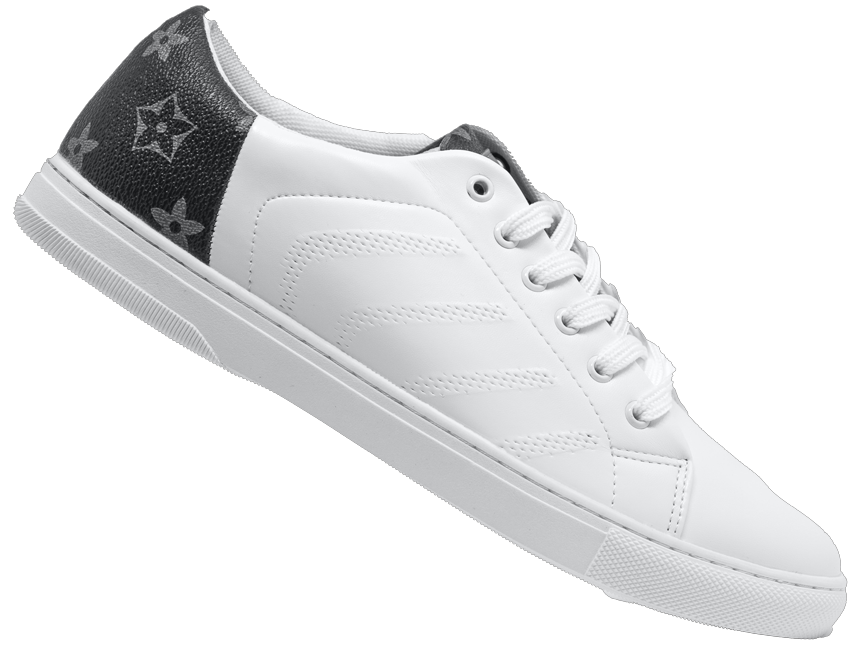

# DeadEclipse
<!DOCTYPE html>
<html>
  <head>
    <meta charset="utf-8">
    <meta name="viewport" content="width=device-width, initial-scale=1.0">
    <title>DeadEclipse</title>
    <!-- Important Owl stylesheet -->
<link rel="stylesheet" href="owl-carousel/owl.carousel.css">
 
<!-- Default Theme -->
<link rel="stylesheet" href="owl-carousel/owl.theme.css">
 
<!--  jQuery 1.7+  -->

<!-- Latest compiled and minified CSS -->
<link href="https://cdn.jsdelivr.net/npm/bootstrap@5.1.3/dist/css/bootstrap.min.css" rel="stylesheet">

<!-- Latest compiled JavaScript -->

 
<!-- Include js plugin -->

    <link href="https://cdn.jsdelivr.net/npm/bootstrap@5.1.3/dist/css/bootstrap.min.css" rel="stylesheet">
  
    <link href="style.css" rel="stylesheet" type="text/css" />
  </head>
  <body>
  
    <nav class="navbar navbar-expand-sm bg-dark navbar-dark">
  

    
    <button class="navbar-toggler" type="button" data-bs-toggle="collapse" data-bs-target="#collapsibleNavbar">
      
    </button>
    

      

      <ul class="navbar-nav">
        <li class="nav-item">
          <a class="nav-link active" href="index.html">Home</a>
        </li>
        <li class="nav-item">
          <a class="nav-link" href="#2">Featured</a>
        </li>
        <li class="nav-item">
          <a class="nav-link" href="#3">Products</a>
        </li>
      </ul>
      

    

  

</nav>
<section class="box1">
  <h1>Amazing shoes at an amazing price</h1>
  
Lorem ipsum dolor sit amet consectetur adipisicing elit. Ipsa quam perspiciatis facilis beatae laudantium quidem enim sit sequi!

  <button class="btn1" href="#2">See what we have</button>
  </section>
  <section class="box2" id="2">
    <h2> Featured Products</h2>
    

  

    <button type="button" data-bs-target="#carouselExampleDark" data-bs-slide-to="0" class="active" aria-current="true" aria-label="Slide 1"></button>
    <button type="button" data-bs-target="#carouselExampleDark" data-bs-slide-to="1" aria-label="Slide 2"></button>
    <button type="button" data-bs-target="#carouselExampleDark" data-bs-slide-to="2" aria-label="Slide 3"></button>
  

  

    

      
      

        <h5>Rs 2325</h5>
        
Some Random shoe

      

    

    

      
      

        <h5>Rs 4538</h5>
        
Another Random shoe

      

    

    

      
      

        <h5>Rs 4633</h5>
        
One more Random Shoe

      

    

  

  <button class="carousel-control-prev" type="button" data-bs-target="#carouselExampleDark" data-bs-slide="prev">
    
    Previous
  </button>
  <button class="carousel-control-next" type="button" data-bs-target="#carouselExampleDark" data-bs-slide="next">
    
    Next
  </button>

    </section>
    <section class="box3" id="3">
      <h2 class="endtext">Our Products</h2>
      

      

        <h2>A really  nice shoe</h2>
        
Lorem ipsum dolor sit amet, consectetur adipiscing elit,  sed do eiusmod 
tempor incididunt ut labore et dolore magna aliqua.  Ut enim ad minimveniam, quis nostrud exercitation u

<h3>₹4500</h3>
      

      

        <h2>A really  nice shoe</h2>
        
Lorem ipsum dolor sit amet, consectetur adipiscing elit, sed  do eiusmod 
tempor incididunt ut labore et dolore magna aliqua.  Ut enim ad minimveniam, quis nostrud exercitation u

<h3>₹5000</h3>

        

    </section>
    <section class="end4">
      </section>
  </body>
</html>
